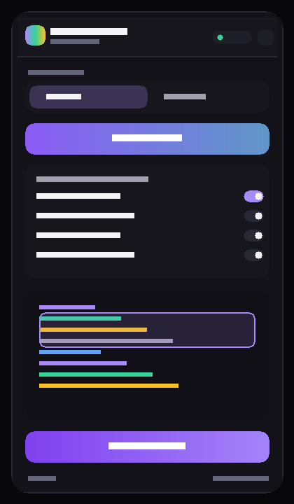

# UI Copy-Paste

<p align="center">
  
</p>

<p align="center">
  <strong>Chrome extension that turns any website UI into clean React + Tailwind components.</strong><br/>
  Hover → click → Generate (AI) with <em>your</em> API key → copy, download, or write straight into your project.
</p>

<p align="center">
  <a href="#install-in-chrome"></a>
  <a href="#bring-your-own-key"></a>
  <a href="LICENSE"></a>
  <a href="#stack"></a>
  <a href="#stack"></a>
</p>

<p align="center">
  
  
  
  
  
</p>

---

## Demo

<p align="center">
  
  &nbsp;
  
  &nbsp;
  
</p>

| Pick any element | Generate with your key | Export to project |
|:---:|:---:|:---:|
| Inspector highlights blocks on the live page | OpenAI · Claude · any OpenAI-compatible API | Copy · Download `.tsx` · write via local bridge |

---

## Features

- **Element & full-page capture** — point-and-click inspector or whole-page skeleton
- **Local DOM → JSX** instantly, plus **AI polish** (structure, interactivity, a11y)
- **Screenshot path** for Canvas / heavily obfuscated UIs
- **De-brand controls** — strip logos, images → placeholders, lorem text, neutral palette
- **BYOK only** — paste *your* OpenAI / Claude / DeepSeek (or any OpenAI-compatible) key; no free tier, no shared quota
- **Streaming Generate** — watch code appear token-by-token
- **Export** — clipboard, file download, or **To project** via `npx ui-copy-paste` bridge
- **Side panel UI** (not a popup) — stays open while you click the page
- **EN / RU** interface, light · dark · system theme
- **Privacy-first MV3** — `activeTab` only, no `<all_urls>`, content script injected on demand

---

## Quick start

### 1. Clone & install

```bash
git clone https://github.com/yiaany/ui-copy-paste.git
cd ui-copy-paste
pnpm install
```

> Need pnpm? `corepack enable && corepack prepare pnpm@latest --activate`

### 2. Build the extension

```bash
pnpm build          # → dist/
```

### 3. Load in Chrome

1. Open `chrome://extensions`
2. Enable **Developer mode** (top-right)
3. **Load unpacked** → select the `dist/` folder
4. Pin the **UI Copy-Paste** icon

<details>
<summary>📸 Step-by-step</summary>

1. Developer mode ON  
2. Load unpacked → `…/ui-copy-paste/dist`  
3. Click the extension icon on any normal website (not `chrome://`)  
4. Side panel opens on the right  

</details>

### 4. Start the backend (required for Generate AI)

```bash
cd backend
pnpm install --ignore-workspace
cp .env.example .env          # optional: BACKEND_AUTH_TOKEN, PORT
pnpm dev                      # http://localhost:8799
```

Or double-click `backend/start-backend.bat` on Windows.

### 5. Connect your API key

1. Open the side panel → **Settings** (gear) → **Model**
2. Choose provider:
   - **OpenAI** — API key + model (e.g. `gpt-4o`)
   - **Claude** — Anthropic key (model optional)
   - **OpenAI-compat** — base URL + key + model (DeepSeek, Groq, local LM Studio, …)
3. Save is automatic. Badge **own key** appears in the header.

> Your key stays in `chrome.storage.local` and is sent to the backend **only for that request**. The backend does **not** log or store it.

### 6. Capture & generate

1. Open any site (e.g. `https://example.com`)
2. Click the extension → **Pick an element** (or **Capture page**)
3. Click the block you want
4. Hit **Generate (AI)**
5. **Copy** / **Download** / **To project**

---

## Install in Chrome (unpacked)

```text
chrome://extensions  →  Developer mode  →  Load unpacked  →  dist/
```

| Requirement | |
|---|---|
| Browser | Chrome / Edge / Brave (Chromium, MV3) |
| Node | 20+ (22/24 OK) |
| Package manager | pnpm 11+ |

Dev mode with HMR:

```bash
pnpm dev            # Vite :5173, output still in dist/
# then Reload the extension on chrome://extensions after manifest changes
```

---

## Bring your own key

There is **no free shared tier**. Generate (AI) always uses the key you configure.

| Provider | Fields |
|---|---|
| OpenAI | `apiKey`, `model` |
| Claude (Anthropic) | `apiKey`, optional `model` |
| OpenAI-compatible | `baseUrl`, `apiKey`, `model` |

Examples for OpenAI-compat:

| Service | Base URL | Model example |
|---|---|---|
| DeepSeek | `https://api.deepseek.com/v1` | `deepseek-chat` |
| Groq | `https://api.groq.com/openai/v1` | `llama-3.3-70b-versatile` |
| OpenRouter | `https://openrouter.ai/api/v1` | `openai/gpt-4o` |
| LM Studio / local | `http://localhost:1234/v1` | your local model id |

---

## Export to your editor

### Clipboard / file
- **Copy** — JSX/TSX to clipboard  
- **Download** — `<Name>.tsx` or `.jsx`

### Straight into the project

In the **root of the target app**:

```bash
npx ui-copy-paste
# listens on http://localhost:31337 and writes src/components/<Name>.tsx
```

Then press **To project** in the side panel.

---

## Architecture

```text
┌─────────────┐     activeTab      ┌──────────────┐
│  Side panel │ ◄────────────────► │ Content script│  (injected on click)
│  (React)    │                    │ inspector DOM │
└──────┬──────┘                    └──────────────┘
       │ HTTP localhost
       ▼
┌─────────────┐     BYOK key       ┌──────────────┐
│   Backend   │ ─────────────────► │ OpenAI/Claude│
│  :8799      │   passthrough      │ / compat API │
└─────────────┘                    └──────────────┘
       │
       │ optional bridge :31337
       ▼
┌─────────────┐
│ Your repo   │  src/components/*.tsx
└─────────────┘
```

- **Side panel** — UI, settings, preview, export  
- **Background SW** — open panel + inject content script  
- **Content script** — hover outline, extract DOM / screenshot crop  
- **Backend** — thin proxy, prompt, stream, validate TSX  
- **CLI bridge** — write files on disk without a file picker  

---

## Stack

| Layer | Tech |
|---|---|
| Extension | Vite 7 · @crxjs/vite-plugin · React 18 · TS strict · Tailwind v4 · Framer Motion · Zod |
| Backend | Hono · Node · Anthropic / OpenAI-compatible SDKs |
| Bridge | tiny local HTTP server (CLI) |
| Quality | ESLint · Prettier · Vitest |

---

## Scripts

```bash
pnpm dev          # HMR dev build → dist/
pnpm build        # production build
pnpm test         # vitest
pnpm lint
pnpm typecheck
pnpm format
```

Backend:

```bash
cd backend && pnpm dev
```

---

## Project layout

```text
ui-copy-paste/
├─ manifest.config.ts       # MV3 manifest (typed)
├─ src/
│  ├─ assets/               # extension icons
│  ├─ background/           # service worker
│  ├─ content/              # inspector + extractor
│  ├─ sidebar/              # React side panel
│  └─ lib/                  # settings, backend client, i18n, jsx render…
├─ backend/                 # Generate (AI) proxy (BYOK)
├─ cli/                     # npx ui-copy-paste bridge
├─ docs/screenshots/        # README shots
└─ dist/                    # load this folder in Chrome
```

---

## Privacy & safety

- Permissions: `activeTab`, `scripting`, `storage`, `sidePanel` + localhost hosts only  
- No static `<all_urls>` content scripts  
- API keys never leave your machine except as HTTPS passthrough to the model provider via your backend  
- Sensitive pages (payment / bank login patterns) are blocked before generation  
- De-brand tools help produce a legal skeleton without copying brand assets 1:1  

---

## Troubleshooting

| Symptom | Fix |
|---|---|
| Generate fails immediately | Start backend (`backend/start-backend.bat` or `pnpm dev` in `backend/`) |
| “Need API key” | Settings → Model → paste key + required fields |
| Inspector does nothing | Open a normal https site (not `chrome://` / Web Store) |
| To project fails | Run `npx ui-copy-paste` in the target project root |
| Extension stale after pull | `pnpm build` then **Reload** on `chrome://extensions` |

---

## Contributing

PRs welcome. Keep the BYOK-only model (no shared free quota), preserve privacy defaults, and add tests for pure logic under `src/lib` / `backend/src`.

```bash
pnpm test && pnpm lint && pnpm typecheck
```

---

## License

[MIT](LICENSE) © yiaany

---

<p align="center">
  <a href="https://github.com/yiaany/ui-copy-paste">⭐ Star on GitHub</a>
  ·
  <a href="https://github.com/yiaany/ui-copy-paste/issues">Report issue</a>
  ·
  <a href="#quick-start">Get started</a>
</p>
